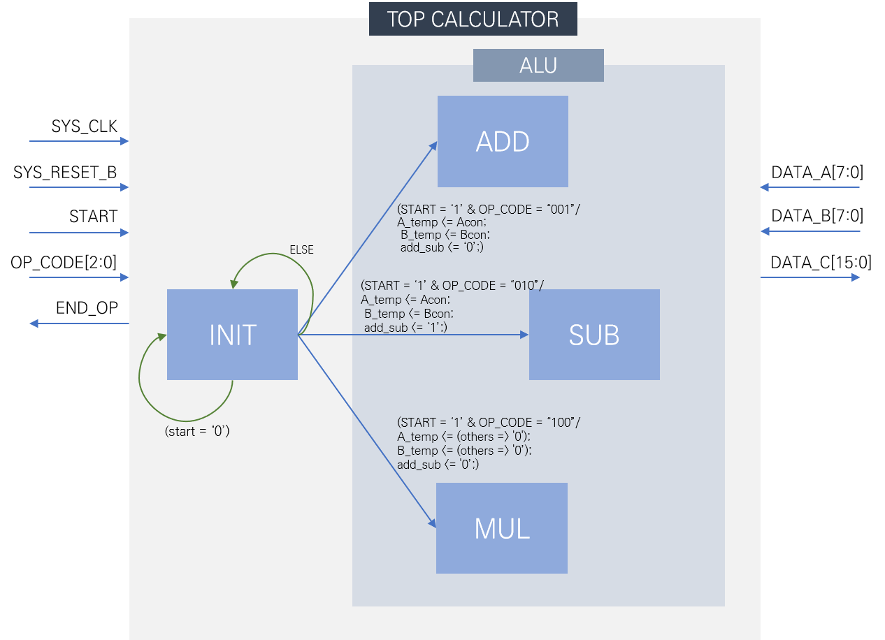

# SE273 Project

### Term project : A simple calculator design

## Purpose

Design a simple calculator that performs addition, subtraction, and multiplication. Algorithm for each operation shall be implemented using SM chart, but shall be designed using minimal logic, and the design shall be designed in a top-down manner, but after verifying the design of each block, the entire block is integrated to complete the design. Use simulation through test bench to verify the circuit that you designed.

## Design

****

